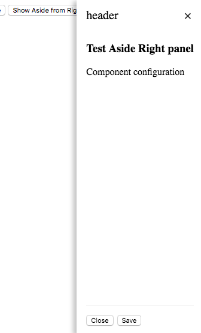

# NgxAside

Angular Aside Component. Simple Angular Sidebar Panel.
  
<hr>

[Demo](https://stackblitz.com/edit/github-2w7ln4?file=src%2Fapp%2Fapp.module.ts)

<hr>

# Installation

```shell
npm install --save ngx-aside
yarn add ngx-aside
```
# Usage

```TypeScript
//app.module.ts
import { NgxAsideModule } from 'ngx-aside';
import { BrowserAnimationsModule } from '@angular/platform-browser/animations';

@NgModule({
    imports: [
        NgxAsideModule,
        BrowserAnimationsModule
        ]
    })
```
For animations please import the ```BrowserAnimationsModule```.

```Html
<ngx-aside #NgxAsidePanelRight
           
           (cancel)="onCancel()"
           (submit)="onSave()"

           [title]="'Title'"
           [cancelButtonTitle]="'Discard'"
           [submitButtonTitle]="'Send'"

           [closeOnEscape]="false"
           [showOverlay]="false"

           [showDefaultFooter]="true"
           [showDefaultHeader]="true">
           
</ngx-aside>

<button (click)="NgxAsidePanelLeft.show()">Show Sidebar panel</button>

```


You can disable default header and footer of panel
```Html    
    [showDefaultFooter]="false"
    [showDefaultHeader]="false"
```


Add custom header and footer to the panel
```Html
    <ngx-aside #NgxAsidePanelRight
               [showDefaultFooter]="false"
               [showDefaultHeader]="false">
    
        <header>My own header with own styles</header>
        
    
        <footer>
            My own footer, with custom buttons
            <button (click)="NgxAsidePanelRight.hide()">
                Close
            </button>
        </footer>
    
    </ngx-aside>

```
# Screenshots


 Position left |  Position right
 ------------ | -------------
 | 
<br/>Custom header and footer |  
 |


# NgxAsideDemo

This project was generated with [Angular CLI](https://github.com/angular/angular-cli) version 6.1.5.

## Development server

Run `ng serve` for a dev server. Navigate to `http://localhost:4200/`. The app will automatically reload if you change any of the source files.

## Code scaffolding

Run `ng generate component component-name` to generate a new component. You can also use `ng generate directive|pipe|service|class|guard|interface|enum|module`.

## Build

Run `ng build --prod ngx-aside` to build the library. The build artifacts will be stored in the `dist/` directory. Use the `--prod` flag for a production build.

## publish

After making build go to relevant directory and hit `npm update && npm publish`

## Running unit tests

Run `ng test` to execute the unit tests via [Karma](https://karma-runner.github.io).

## Running end-to-end tests

Run `ng e2e` to execute the end-to-end tests via [Protractor](http://www.protractortest.org/).

## Further help

To get more help on the Angular CLI use `ng help` or go check out the [Angular CLI README](https://github.com/angular/angular-cli/blob/master/README.md).
